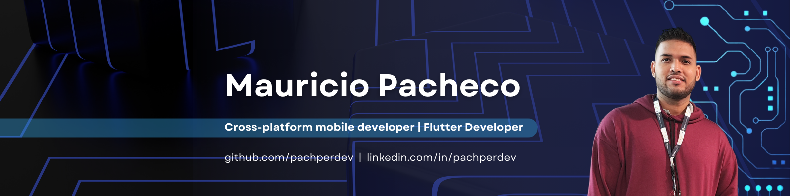

# ¡Hola! Soy pachperdev 👋

## Sobre Mí

Soy un apasionado Desarrollador Flutter con experiencia en liderazgo y trabajo en equipo. Soy Ingeniero Electrónico y tengo habilidades en diseño y desarrollo de aplicaciones multiplataforma usando Dart y Flutter. He trabajado en equipos de alto rendimiento y liderado proyectos exitosos en empresas multinacionales de software.

## Habilidades Técnicas

- **Lenguajes:**
  
  
  
  
  
  
  
  
- **Herramientas:**
  
  
  
  
  
  
  
  
  

- **Idiomas:**
  - 
  - 

## Contacto

- : [Mauricio Pacheco](https://www.linkedin.com/in/pachperdev)
- : [pachperdev](https://github.com/pachperdev)
- : [@mauricio_pachper_](https://www.instagram.com/mauricio_pachper_)
- : [pachperdev@gmail.com](mailto:pachperdev@gmail.com)
- : [Mauricio Pacheco CV](./CV-Mauricio-Pacheco-ES.pdf)

---

¡Gracias por visitar mi perfil! No dudes en contactarme si tienes alguna pregunta o proyecto en mente.
